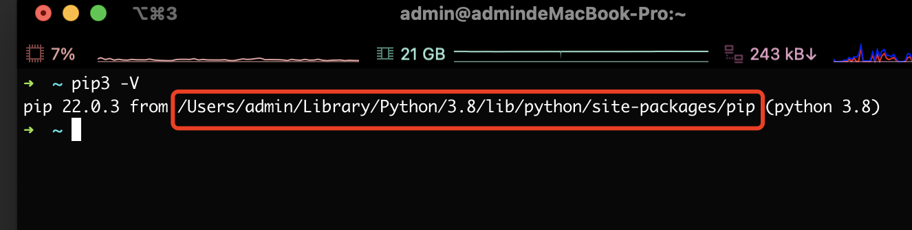
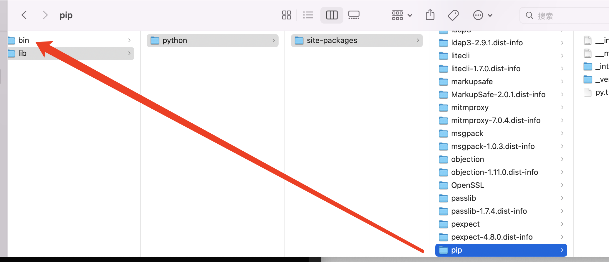
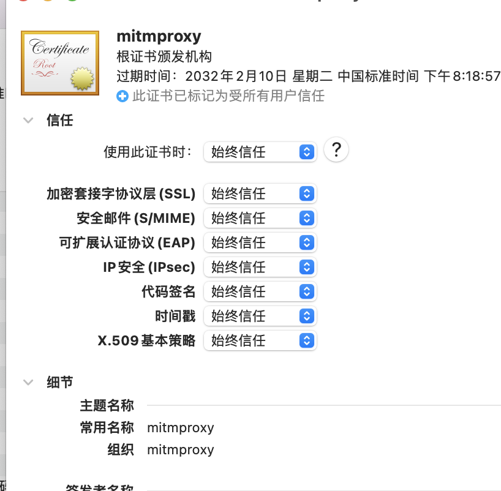
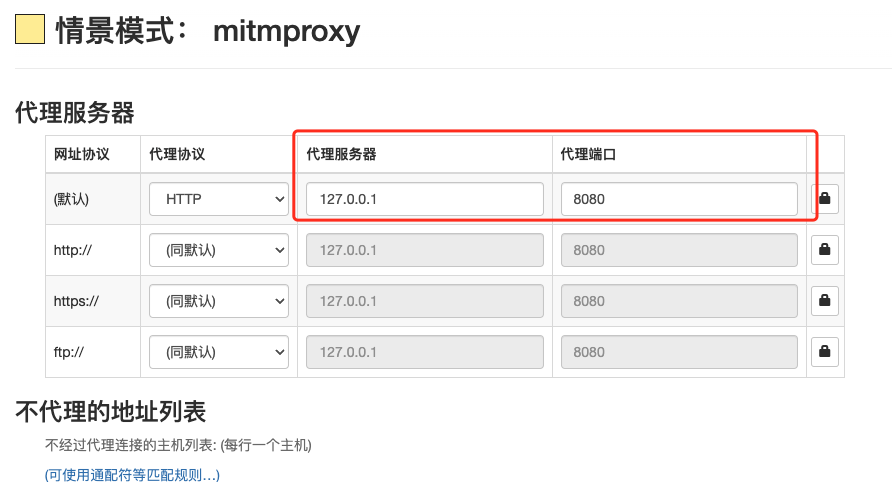
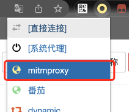

## [Mitmproxy + SwitchOmega + 油猴 + Python](https://puffhub.github.io/)

**Mitmproxy 下载**

```
brew mitmproxy
```
or

```
pip3 install mitmproxy
```

**使用pip进行安装后, 需要重启控制台才能执行mitmproxy, 如果重启后还是找不到这个命令的, 可以在控制台输出```pip3 -V``` 查看pip3安装的路径, 之后一直往上找找到这个bin目录, 之后添加到环境变量即可.**




## 开始使用
具体的参数可以在网上查到, 这里只记录一下不好抓的网站如何通过这种方式进行抓包并交由python处理.

### 1、配置证书
Mitmproxy安装好之后, 会在本地生成一个目录, 位置在 ```~/.mitmproxy``` 下, 如果不安装证书的话是无法抓取https的包的

Mac用户双击 ```mitmproxy-ca-cert.cer```, 如果需要密码的话输入空即可. **添加到钥匙串中的系统下**

在钥匙串中选择该证书, 并选择始终信任, 就可以开始抓包之旅了~


<br />
### 2、配置SwitchOmega验证
下载插件```SwitchOmega```, 并打开。

新建情景模式, 选择HTTP (其余的是自动同步的), 在后面的两栏中按照下图填入


设置完成后, 左下角又个应用选项, 点击即可保存～

随后我们使用命令 ```mitmweb``` 进行验证一下, 输入命令后, mitmproxy会自动启动两个端口, 一个是8080(代理端口), 一个是8081(flask服务端口).

敲入```mitmweb```后会发现打开了一个浏览器, ```localhost:8081```, 这就是mitmweb给你的一个类似控制台的页面

之后我们新打开一个普通的窗口, 在将插件```SwitchOmega``` 打开, 选择我们刚才配置好的情景模式


此时访问百度, 可以在刚才的控制台页面看到有请求出现了. 那就证明我们配置完成了.


## 油猴脚本
油猴脚本也是一个Chrome插件,  他可以在访问任意网址的时候注入一段我们自定义的js, 具体的可以查一下详细说明.

这里只列举几个我常用的点

- 油猴文件头:
	- @name: 脚本名称
	- @match: 要匹配的地址 (正则表达式匹配页面地址, 匹配到就注入)
	- @run-at: 注入的时机 (document-start、document-end)

- js代码
	- 访问window对象: 无法获取到页面window时(获取出来是个Proxy), 可以使用```window.unsafeWindow```当做当前页面window对象.
	- 使用定时器```setInterval``` 来扫描页面状态

- 跨域请求
	- 发送跨域请求: [https://www.cnblogs.com/onlyxx/p/5179459.html](https://www.cnblogs.com/onlyxx/p/5179459.html)


## Python MitmProxy使用
**如果想将拦截到的请求交给python处理, 可以这样使用**

main.py
```
import mitmproxy.http
import os

base_path = "/Users/admin/Desktop/kx3w/Frida高级逆向（2020版）/课时3 Frida hook nativeEDIUS_x264"
class Counter:
    def __init__(self):
        pass

    def request(self, flow: mitmproxy.http.HTTPFlow):
        print('发送请求啦: {}'.format(flow.request.url))

    def response(self, flow: mitmproxy.http.HTTPFlow):
        print('拦截到请求 URL:{}, RESPONSE:{}'.format(flow.request.url, flow.response.text))
addons = [
    Counter()
]
```

在命令行下使用 ```mitmdump -q -s main.py``` 就可以通过python处理抓到的请求了

注： mitmdump的参数可以在网上查到, 这里的-s为指定某个脚本, -q为屏蔽mitmproxy的输出, 只会输出python脚本中打印的内容


