# [IDA Pro 动态调试iOS应用](https://puffhub.github.io/Crack/iOS-Crack/)

通过Ida Pro静态分析比较费劲的时候, 可以使用Ida Pro 动态调试想调试的App.


### IDA Pro7.2+
本来用IDA Pro 7.0, 结果发现我这个7.0的版本不支持iOS Debugger, 所以找了一个7.2的版本. 


### 使用IDA Pro 加载待调试的App
当ida 加载的差不多了之后, 就可以开始配置 & 调试App了.
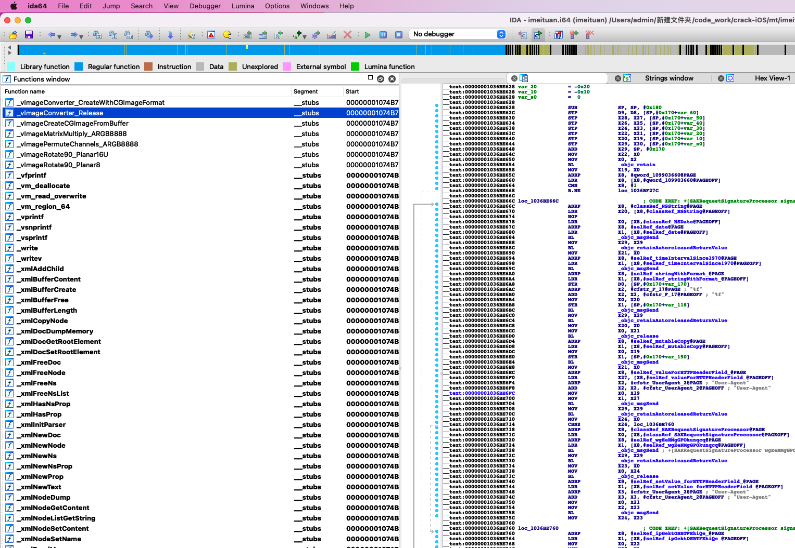

<br />
### 选择Debugger
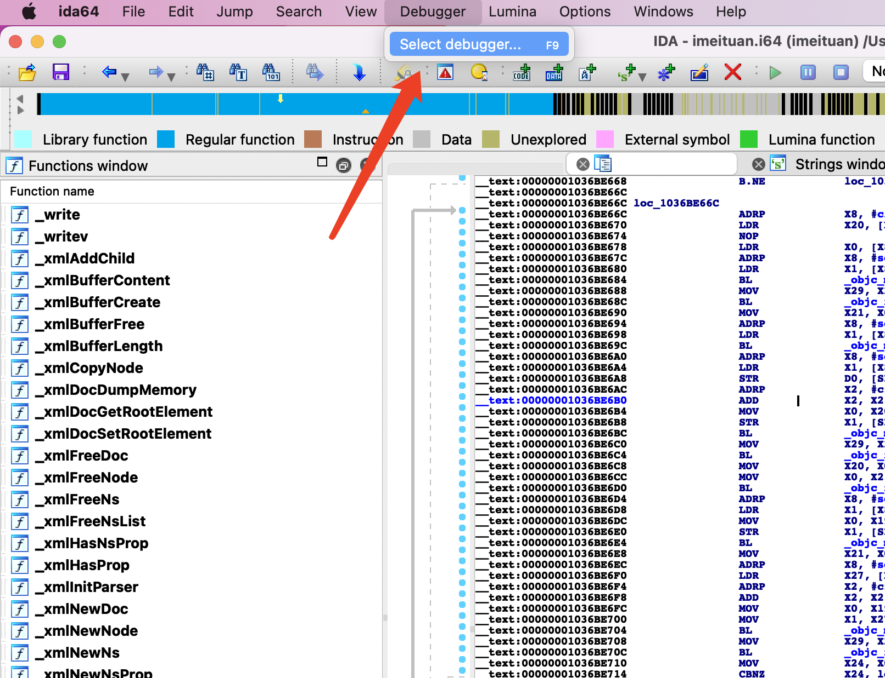

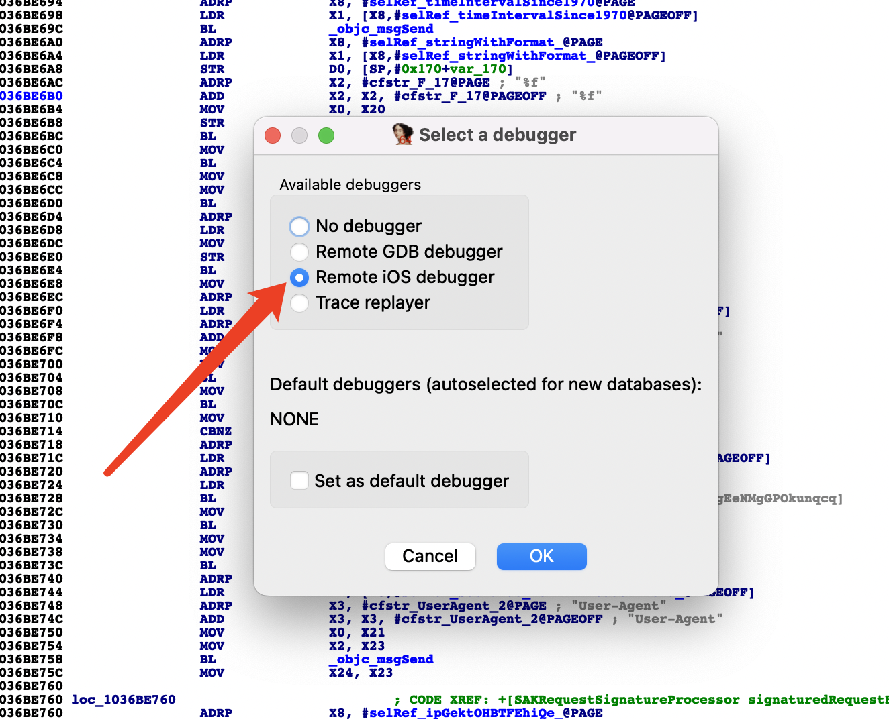

<br />
### 配置Symbol
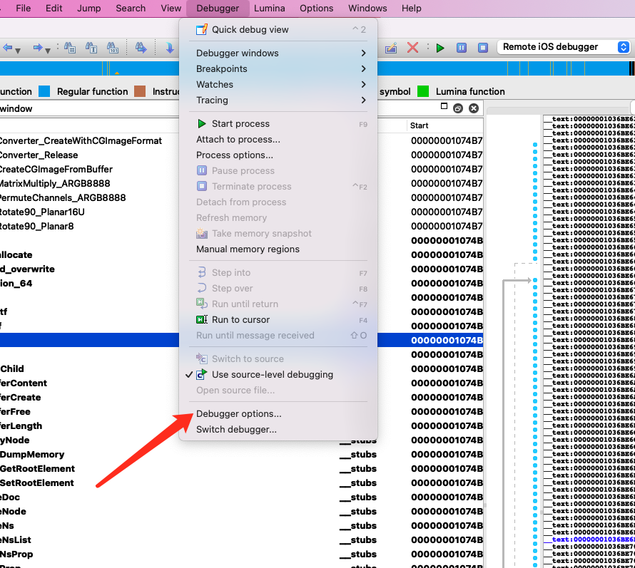
<br />
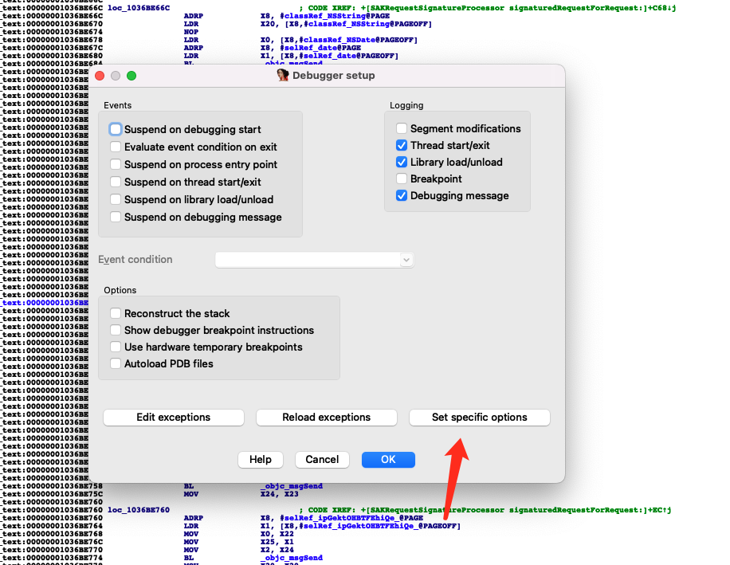
<br />
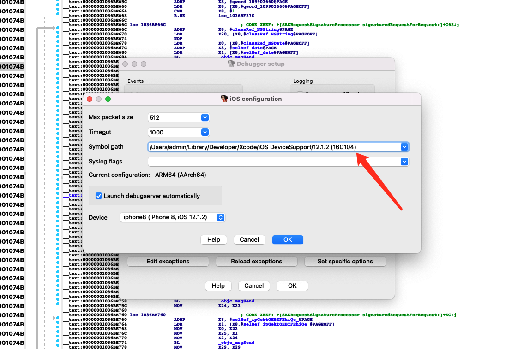

#### 这里的路径在```~/Library/Developer/Xcode/iOS DeviceSupport``` 下, 按照具体的型号选择。如果不知道当前设备的型号, 可以在Xcode中查看
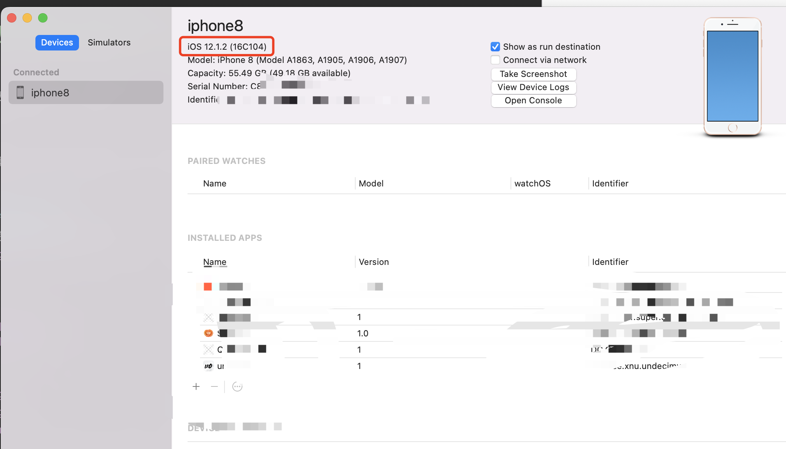

<br /><br />
### 开始设置待调试App
选择Process Options
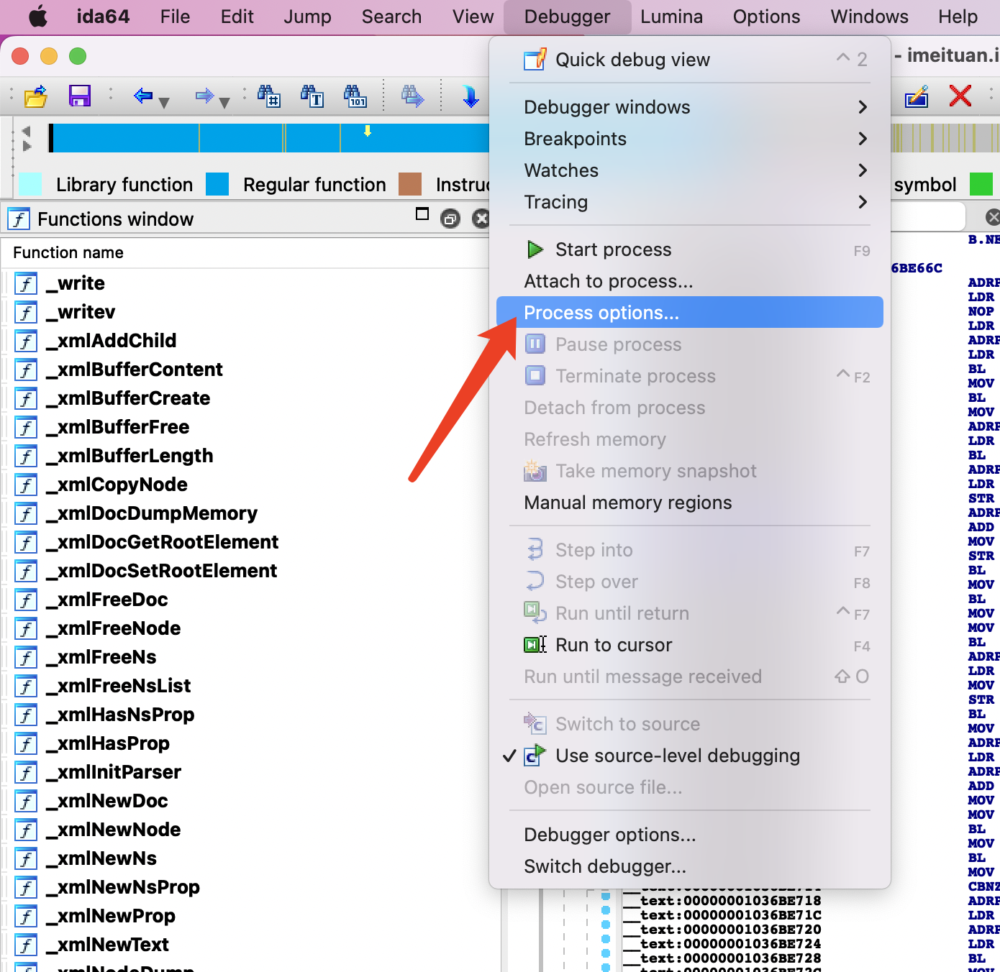

填写App路径 (手机上的)
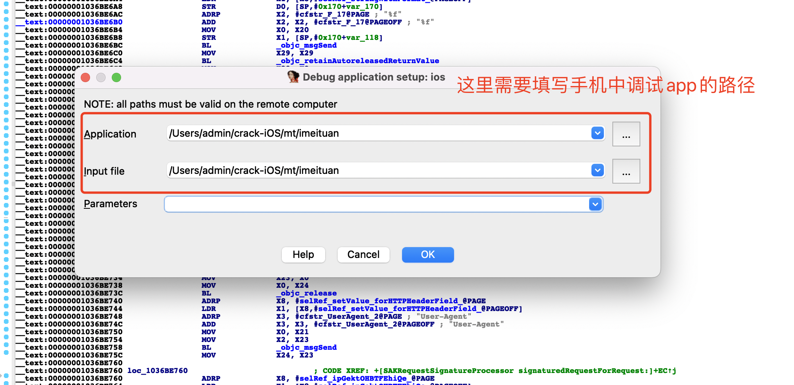

找路径的话 可以使用iproxy命令 + ssh 连接到手机上，随后在```/var/contains/Bundle/Application/``` 下找路径
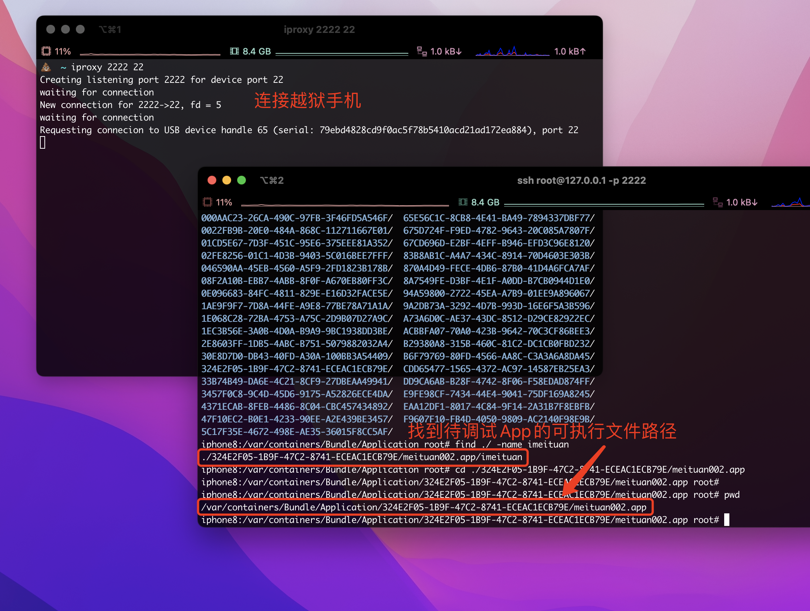
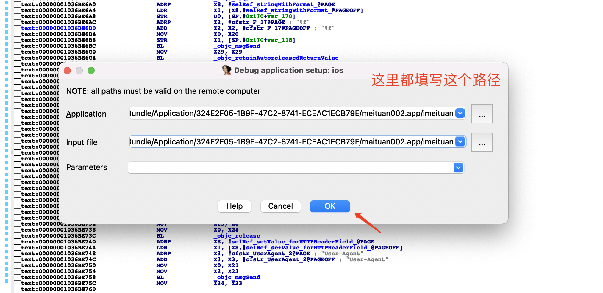

### 开始调试！
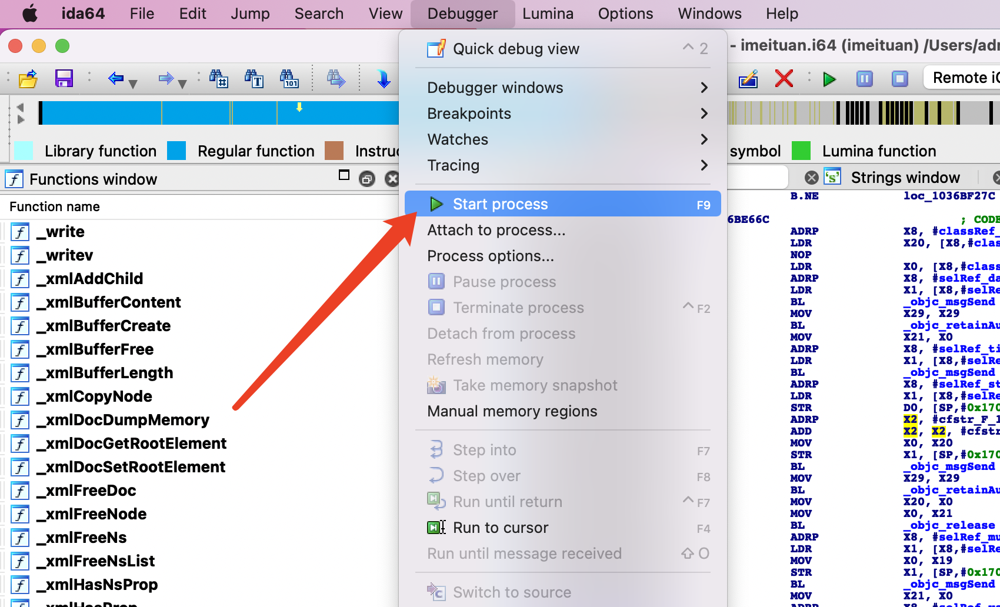

这时候就可以看到, 手机已经启动了目标 App, 同时可以在IDA Pro中下断点进行调试.

