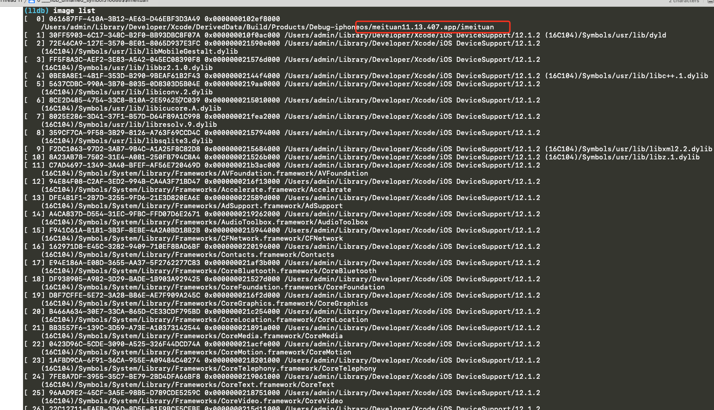
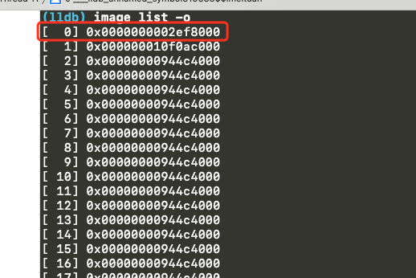
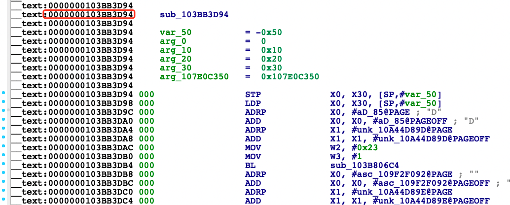
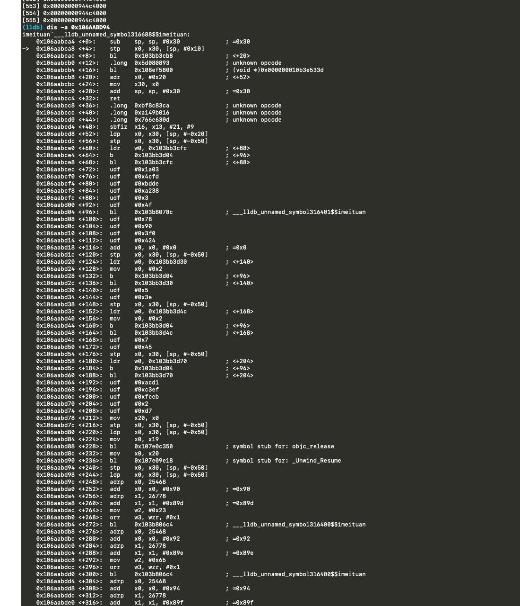

# [LLDB](https://puffhub.github.io/Crack/iOS-Crack/)

开发/逆向过程中, 在Xcode中进行下断点, 可以通过LLDB进行调试。 逆向时想调试还未触发的方法可以hook之前走的类并且提前断住, 配合IDA Pro，就可以通过LLDB在执行方法前断点。
## 常用命令
- **下断点命令**
	- ``` breakpoint set -a 0x106AABD94```
- **通过地址查找对应的image**

	- ```image lookup -a 0x106AABD94```
- **查看工程中可执行image和依赖的共享库image** (第一条为当前App的主进程(不带-o参数可以看到image名称, 带-o参数则是偏移之前的地址), 也就意味着**第一条的地址**就是要找的基地址(Address Space Layout Randomization ASLR)。)

	- ```image list -o``` 
- **反汇编这个地址, 如果这个地址是函数符号, 则看到的是函数反汇编对应的代码**
	- ```dis -a 0x106AABD94```


## 实战
```image list -o``` <br />
查看工程中可执行image和依赖的共享库image, 第一条为当前App的主进程(不带-o参数可以看到image名称, 带-o参数则是偏移之前的地址), 也就意味着**第一条的地址**就是要找的基地址(Address Space Layout Randomization ASLR)。

这是执行```image list```的结果, 一共有500+个image, 可以看到第一条是当前App的主进程.


执行```image list -o``` 查看第一条的基地址


计算实际的函数地址(基地址+偏移量)
**```0x0000000002ef8000 + 0103BB3D94 = 0x106AABD94```**


**通过```dis -a 0x106AABD94 ``` 反汇编这个地址, 如果这个地址是函数符号, 则看到的是函数反汇编对应的代码**

可以看到执行之后看到的就是ida中展示的代码, 可以在这里下断点进行动态调试.


