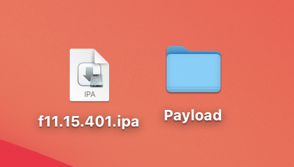
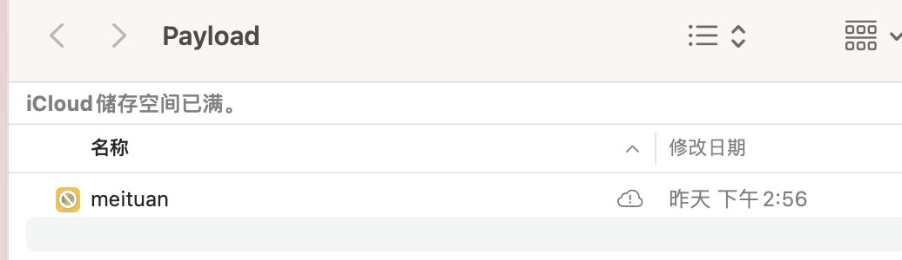

# class-dump

#### class-dump是用来dump目标文件Class信息的工具. 它利用OC语言的runtime特性, 将储存在Mach-O文件中的@interface和@protocol信息提取出来, 并生成对应的.h文件。
class-dump [github地址](https://github.com/nygard/class-dump)

--- 

## 使用方式
### 1、安装
可以在这里下载class-dump的安装包, [http://stevenygard.com/projects/class-dump/](http://stevenygard.com/projects/class-dump/)。下载完成后, 双击dmg进行安装。

###


### 2、获取可执行文件
如果是一个刚砸完壳的.ipa文件, 可以将.ipa文件的后缀改为.zip, 并解压, 可以得一个```Payload```文件夹.



打开后找到这个文件, 并记录其路径。




### 3、开始dump
打开命令行, 输入 ```class-dump -H imeituan.app -o  ~/Desktop/meituanHeader/``` 就开始dump了.


