# [iOS正开发基础知识](https://puffhub.github.io/Crack/iOS-Crack/)

&emsp;[创建一个iOS的App](#创建一个iOS的App)

&emsp;[目录说明](#目录说明)

&emsp;[创建一个按钮并绑定单击事件](#创建一个按钮并绑定单击事件)

&emsp;[待续...](#待续)

iOS的App是如何开发出来的? 界面是如何展示在屏幕上的? 为什么按下一个按钮会跳转到其他页面? 

[本文Demo项目Github地址](https://github.com/puffhub/iOS-Demo)

## 创建一个iOS的App
打开xcode, 点击 Create a new Xcode project.
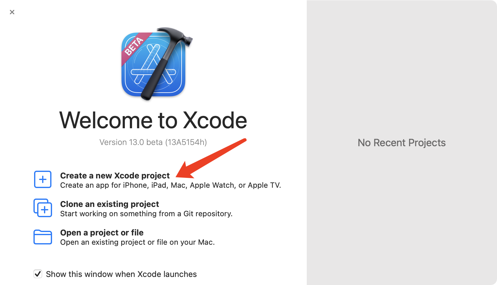

选中iOS下的app
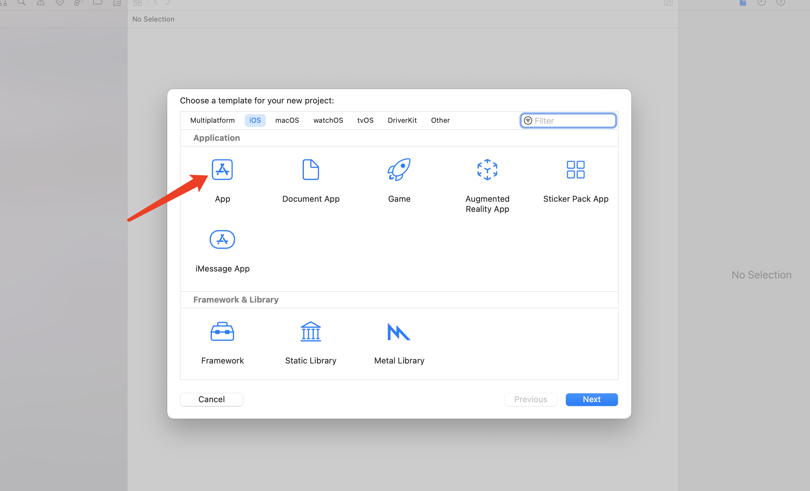

填写应用名称，选择开发者账号
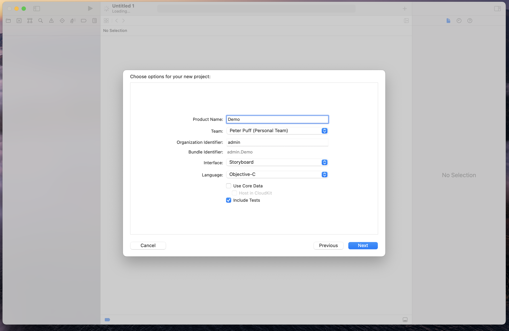

应用创建完毕后的目录
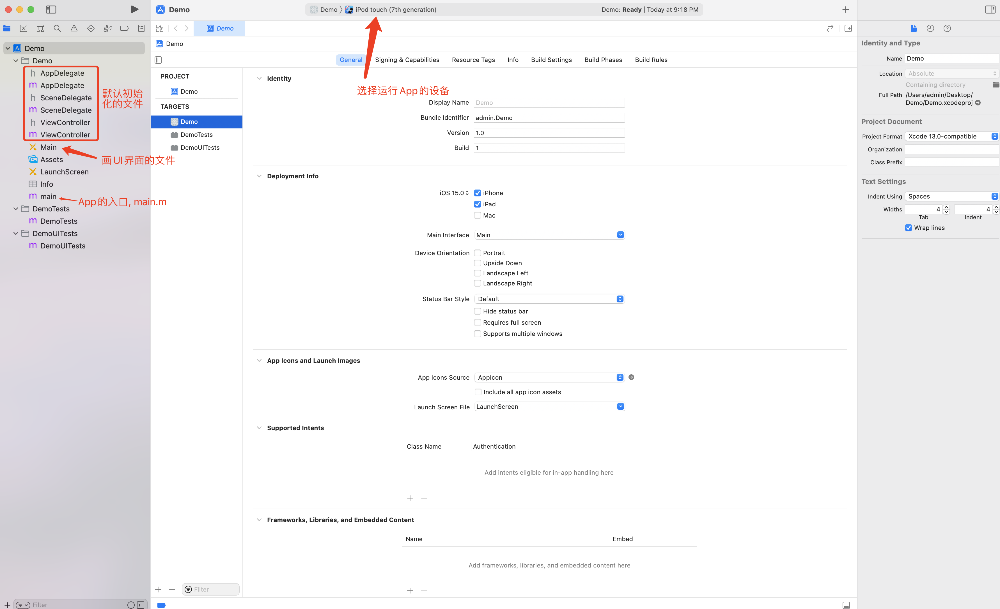


## 目录说明
从主入口```main.m```开始
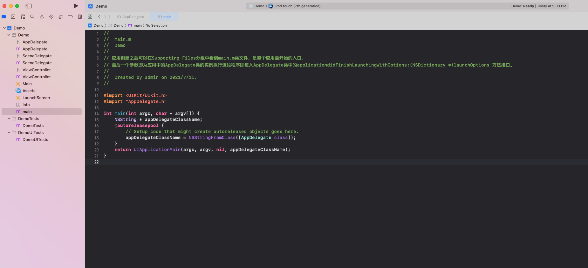


从主入口会调用到```appDelegate.m```文件
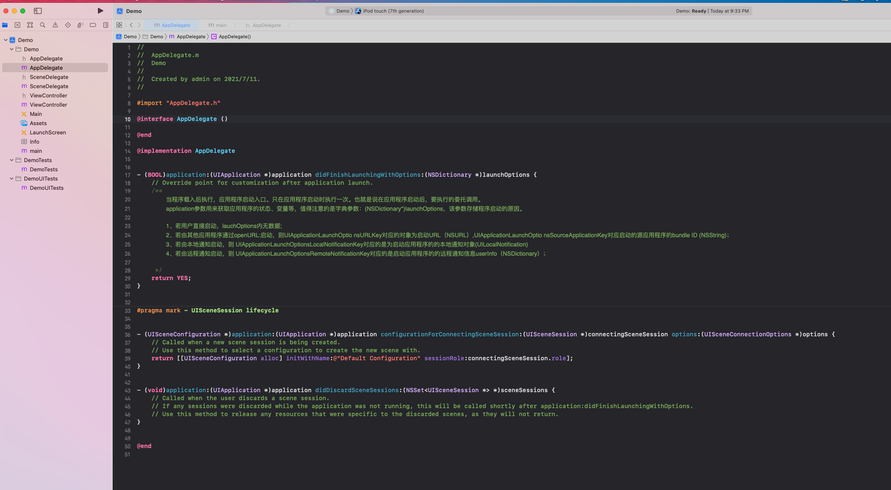


SceneDelegate负责屏幕上显示的内容
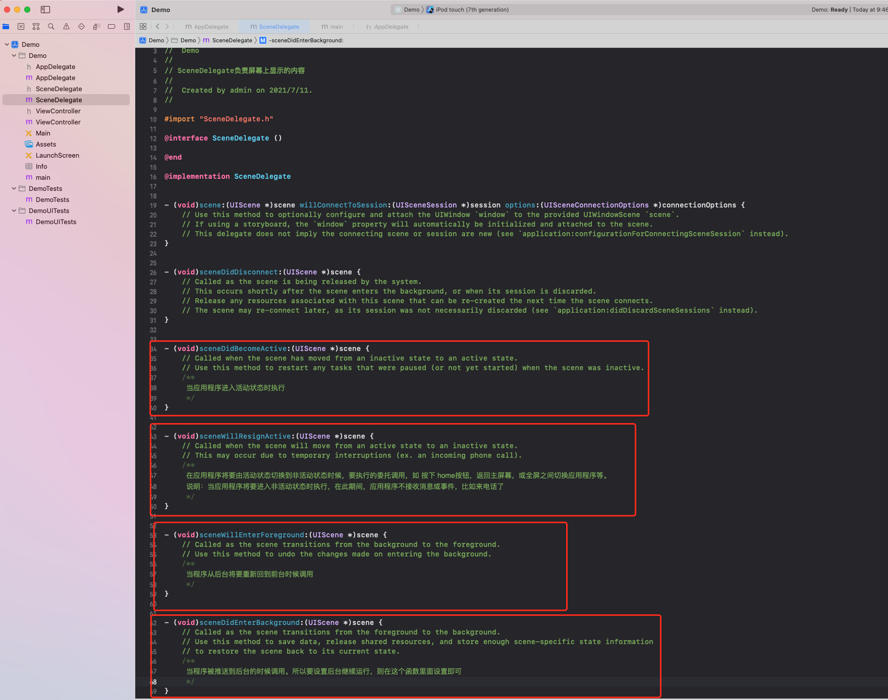


viewController负责控制UI层面的事件
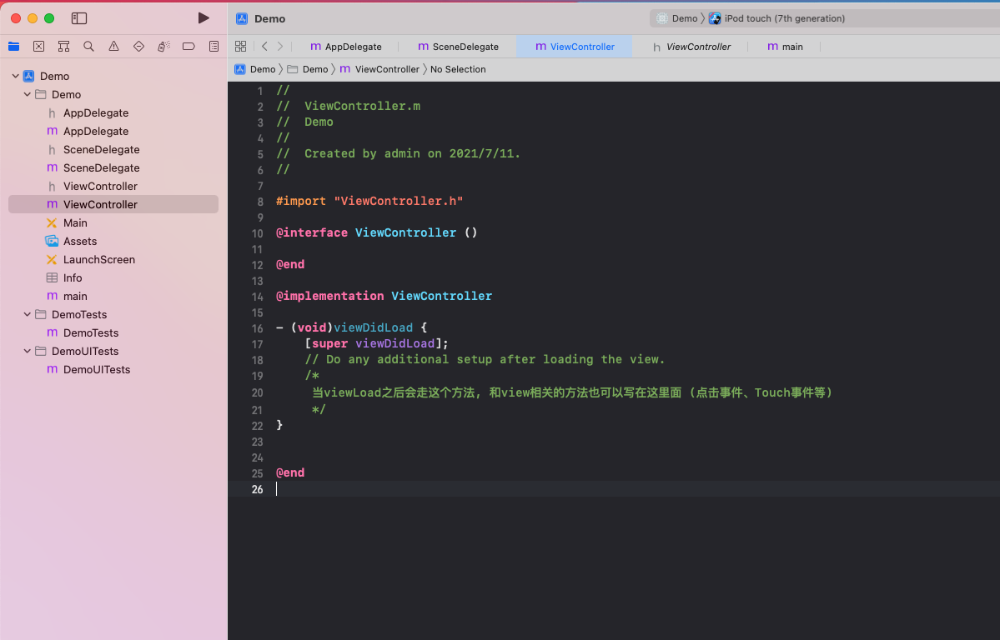

## 创建一个按钮并绑定单击事件
选中```main.storyboard```,  点击右上角加号并搜索button, 将这个button拖拽至屏幕上.
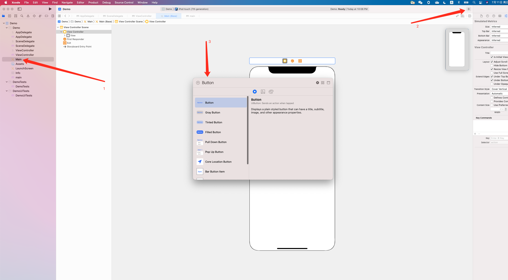

选中拖到屏幕上的按钮后, 可以看到右边的这栏是属性栏, 可以改变button的文字大小等
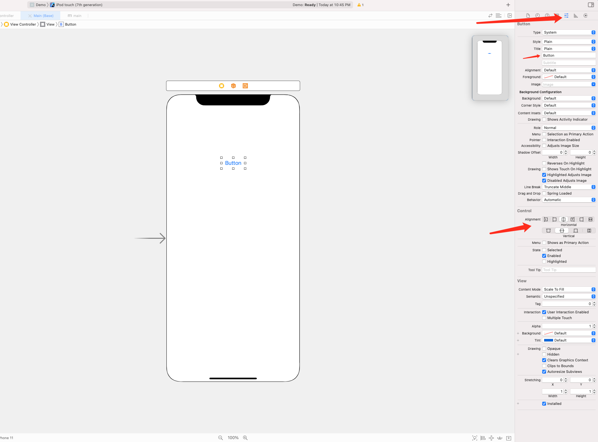

这时候我们回到```viewController```先编写点击要触发的方法
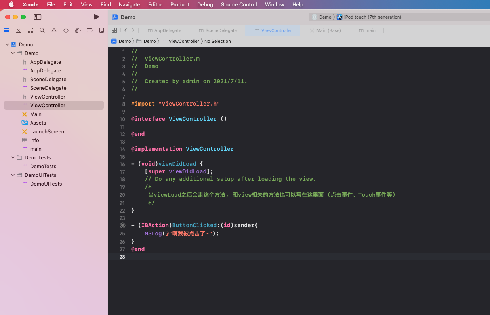

``` objectivec
- (IBAction)ButtonClicked:(id)sender{
    NSLog(@"啊我被点击了~");
}
```


可以看到这里写了一个方法```ButtonClicked```, 一个[sender参数](https://blog.csdn.net/weixin_33840661/article/details/89984708), 返回IBAction类型. 

**IBAction**<br />
- 从返回值角度上看，作用相当于void.
- 只有返回值声明为IBAction的方法，才能跟storyboard中的控件进行连线.
- IBAction只能加在方法上, 不能加在属性上.

随后我们打开```main.storyboard```文件, 右键选择刚才创建好的button, 会发现打开了一个小菜单, 里面有各种UI操作, 我们找到```touchUpInslide```点击右侧加号并拖拽至当前的viewController, 就可以看到刚才写的```ButtonClicked```方法
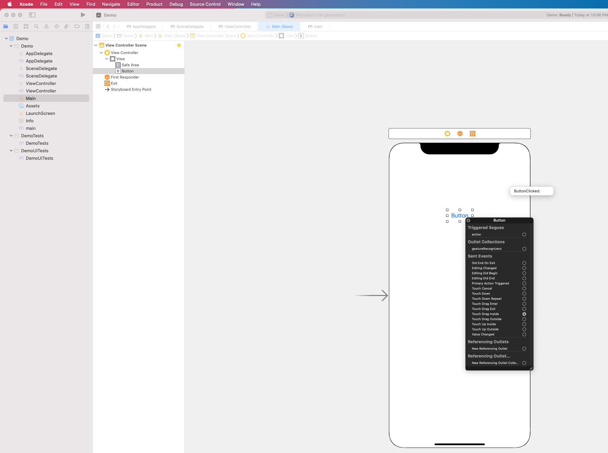

点击左上角运行看效果
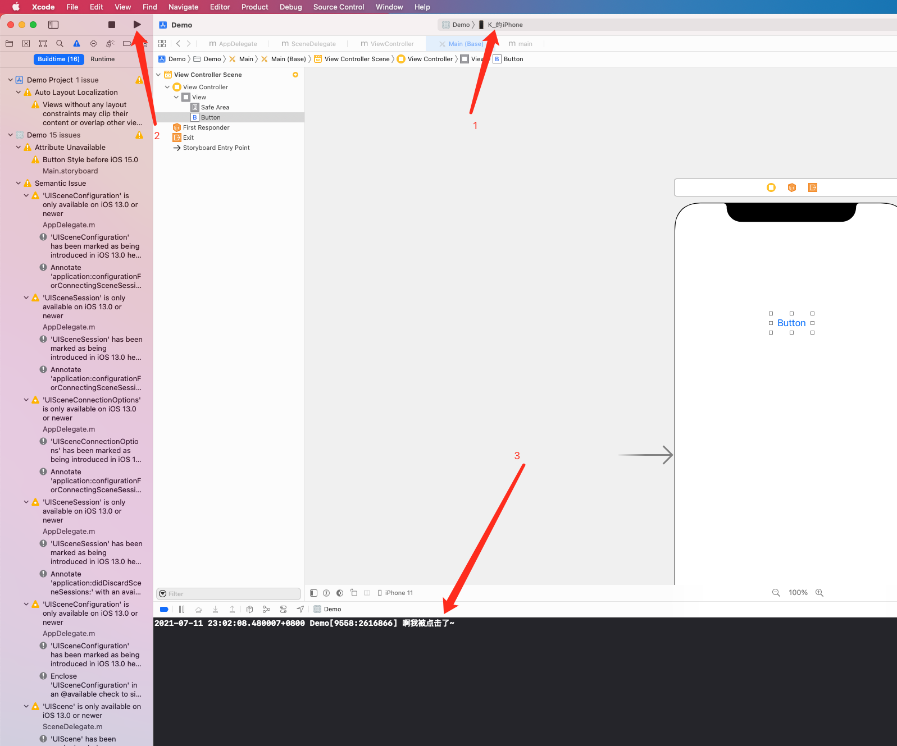
在App上点击按钮可以发现有日志输出了~

## 待续...
