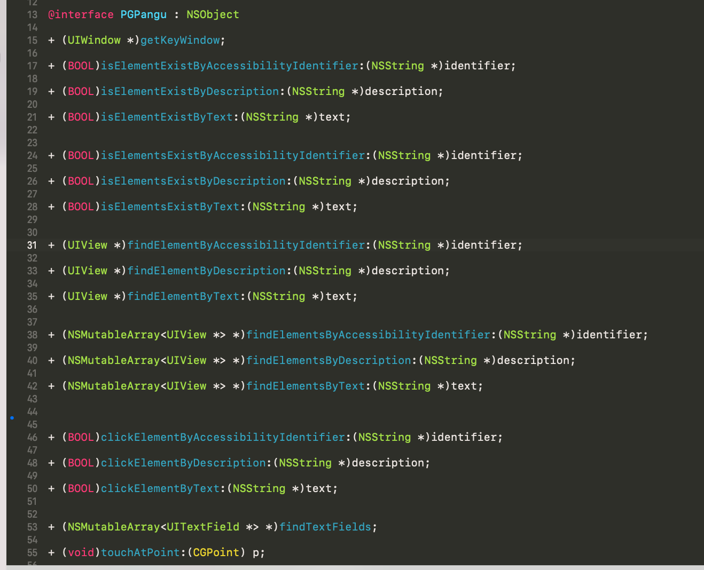

# [iOS自动点击](https://puffhub.github.io/Crack/iOS-Crack/)

## 背景
iOS自动点击顾名思义是在iOS设备上进行模拟点击的操作, 一开始按照想法想做一个类似安卓自动点击技术方案的产品(hook activity生命周期, 控件直接performClick...), 但真正进入开发后, 我发现我想的太简单了...

就目前能查到的资料来看, 想在iOS上实现自动点击, 只有这几种解决方案

- UI Automator （已废弃)
- Appium	(停止更新, Github项目无法跑起来)
- XCUITest	(官方的UI自动化框架)
- KIF	(可用)

<br />
## 方向选择
一个废弃, 一个本地跑不起来...

试试官方框架..

XCUITest框架确实好用, 只需要导入一个framework就可以了, 但后来发现，通过这种方式完成自动点击必须依赖于xcode-build, 这就很狗了啊, 脱机自动点击不香嘛😈

因为目前线上运行的自动点击项目依赖于[PTFakeTouch](https://github.com/Ret70/PTFakeTouch), 但我想尝试更好的方式(不信这个邪), 于是去各个交流群请教, 结果这小子居然把我当傻子耍..


鉴于[PTFakeTouch](https://github.com/Ret70/PTFakeTouch)的原理也是使用KIF进行点击操作, 但只提供了一个点击坐标的方法, 如果想要点击界面上的某个元素, 需要先获取到元素的坐标, 那不如直接在他的基础上进行封装, 封装成类似Appium的API出来直接使用不就好了🤔️...


<br />
## 开发
对安卓自动点击而言, 想要点击一个控件需要先拿到这个控件的对象, 即先获取顶层Activity对象后对```activity.getWindow().getDecorView()```里面的子元素进行遍历, 并判断元素类型, 随后进行performClick()操作。 

iOS同理, 先取到当前顶层的KeyWindow后, 对其子元素进行遍历, 之后获取控件的坐标, 结合[PTFakeTouch](https://github.com/Ret70/PTFakeTouch)进行点击操作😜




目前自测是没什么问题, 所有的代码都支持在子线程内运行, 这样的好处是UI界面不会卡住。 可以在业务逻辑中使用子线程, 也推荐这种写法. 在子线程中可以通过for去不停遍历, 以实现等待元素的效果

后期也会加上一些调试时专用的API， 比如遍历所有 有id的元素, 指定class的元素等等...


