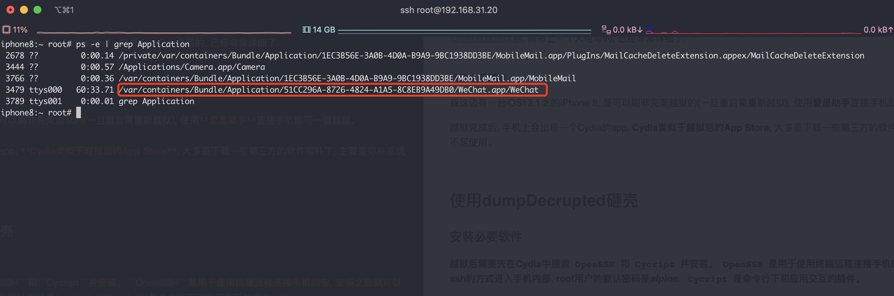
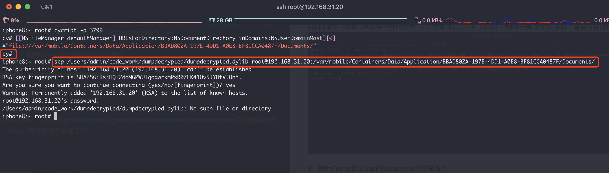
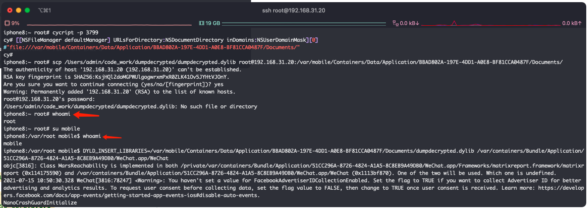

# [iOS越狱&App砸壳](https://puffhub.github.io/iOS-Crack/)


## 越狱

[iOS越狱原理详解](https://www.jianshu.com/p/c5c22f9a06e2), 简书上一个大佬写的, 已经非常详细了.

<br />
**实际上手越狱**

我这边有一台iOS12.1.2 的iPhone 8, 是可以刷非完美越狱的(一旦重启需重新越狱), 使用**爱思助手**连接手机即可一键越狱。

越狱完成后, 手机上会出现一个Cydia的app, **Cydia类似于越狱后的App Store**, 大多是下载一些第三方的软件和补丁, 主要是弥补系统不足使用。

<br />
## 使用dumpDecrupted砸壳
(推荐使用后两种砸壳方式, 方便快捷)

### 安装必要软件
**越狱后需要先在Cydia中搜索```OpenSSH```和```Cycript```并安装。```OpenSSH```是用于使用终端远程连接手机的包, 安装之后就可以通过ssh的方式进入手机内部, root用户的默认密码是*alpine*. ```Cycript```是命令行下和应用交互的插件。**

> **在同一局域网下使用 ```ssh root@192.168.x.x``` 即可以root用户连接到手机内部**
> 
> **连接上之后可以使用 ```passwd```命令修改密码, 再次连接的时候密码就不是*alpine*了**

<br />
### 越狱准备
**下载越狱必备的dylib库 -> ```dumpdecrupted.dylib```, 可以在[github](https://github.com/stefanesser/dumpdecrypted)下载源码自己编译. 将项目clone下来后在项目根目录使用```make```命令即可完成编译.**

<br />
### 开始越狱
#### 1、首先将iPhone的**后台全部清空**, 之后打开要砸壳的app, 此时后台应该只有这一个app存在. 

<br />
#### 2、使用OpenSSH 连接到手机上, 以微信为例, 执行 ```ps -e | grep Application```, 找到相关app的那个进程, 记住pid以及app的路径. (如果出现多条一样的进程, 可以使用```kill -9 {pid}``` 先kill一遍, 然后在手机上重启目标进程)

<br />
#### 3、使用Cycript找出App的Documents文件夹路径

在终端输入 ```cycript -p {pid}```

之后输入
```[[NSFileManager defaultManager] URLsForDirectory:NSDocumentDirectory inDomains:NSUserDomainMask][0]```


输出的红色目录即为目标app的Documents文件夹路径, 前面的```file://```可以无视, 代表文件协议. 我这里的Documents路径实际上是```/var/mobile/Containers/Data/Application/BBAD802A-197E-4DD1-A0E8-BF81CCA0487F/Documents/```

<br />
#### 4、使用scp命令将```dumpdecrupted.dylib``` 丢到```Ducoments```文件夹内.

```scp /Users/admin/code_work/dumpdecrypted/dumpdecrypted.dylib root@192.168.31.20:/var/mobile/Containers/Data/Application/BBAD802A-197E-4DD1-A0E8-BF81CCA0487F/Documents/```

```scp {dumpdecrupted.dylib路径} root@{手机ip}:{目标app的Documents目录}```

这里要注意下就是scp 命令实在shell下使用的, 所以要把之前上面使用的Cycript命令行退出去, 按一次Ctrl+d即可.


<br />
#### 5、砸壳！！！
首先cd到之前的Documents目录下, 执行```su mobile``` (切换到mobile用户)

执行这句话

``` DYLD_INSERT_LIBRARIES={dumpdecrypted.dylib地址} {之前从进程上拷出来的app地址}```

```DYLD_INSERT_LIBRARIES=/var/mobile/Containers/Data/Application/BBAD802A-197E-4DD1-A0E8-BF81CCA0487F/Documents/dumpdecrypted.dylib /var/containers/Bundle/Application/51CC296A-8726-4824-A1A5-8C8EB9A49DB0/WeChat.app/WeChat```




之后就可以在app的Documents目录下看到砸完壳的文件啦~ WeChat.decrypted文件就是


## 使用CrackerXI+砸壳
### 配置Cydia源
打开cydia, 选择软件源点击右上角编辑, 再点击左上角添加, 将```cydia.iphonecake.com```添加至软件源中.

随后在软件源中打开AppCake - 全部软件包, 安装CrackerXI+ .

安装完成后手机上会多出一个app, CrackerXI+ .

打开软件, 点击settings, 将第一个CrackerXI Hook的开关打开, 随后点击AppList, 选择需要砸壳的应用, 在弹窗内选择```YES, Full IPA```

等待砸壳完毕, 砸壳后的ipa文件会放在 ```/var/mobile/Documents/CrackerXI```下, 使用scp下载到本地即可.


## 使用frida-dump砸壳

### Github下载[frida-ios-dump](https://github.com/AloneMonkey/frida-ios-dump)

``` git clone https://github.com/AloneMonkey/frida-ios-dump.git```

### 安装[usbmuxd](https://github.com/libimobiledevice/usbmuxd)
``` brew intall usbmuxd``` 安装过程很漫长... 很漫长.................... (也可能是我安装的时候网络不太好的原因, 逃

### 使用[iProxy](https://github.com/tcurdt/iProxy)
iProxy是一个可以将设备上端口号映射到电脑某个端口的软件, ```iproxy 2222 22``` 这句话的意思就是把设备的22端口映射到电脑的2222端口上. 使用```ssh -p 2222 root@127.0.0.1``` 就可以通过usb连接手机了(连接本地的2222端口), 速度比OpenSSH连接快很多.


### 安装[Frida](https://github.com/frida/frida)
终端使用命令: ```sudo pip install frida```

### 开始砸壳
打开之前下载的```frida-ios-dump```, 如果root密码修改过或端口不是2222, 则需要先修改```dump.py```中的前几行内容
运行的时候可以使用 ```python3 dump.py 微信```进行dump操作, 参数为要dump的包.


### 遇到的异常
报错: ```Failed to enumerate applications: this feature requires an iOS Developer Disk Image to be mounted; run Xcode briefly or use ideviceimagemounter to mount one manually```

解决: 打开一下Xcode即可

<br />
报错: ```need Gadget to attach on jailed iOS; its default location is: xxxx```

解决: 按照PC上frida安装的版本, 去[这里](https://github.com/frida/frida/releases/)下载frida-gadget-ios的包, 并放到报错中提示的位置.

