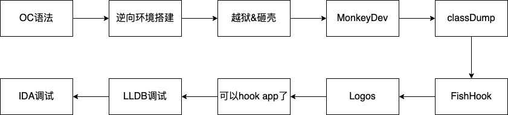

### [iOS逆向相关](https://puffhub.github.io/)

> 0x00 [Objective-C 语法基础✅](./Objective-C语法基础.md)
> 
> 0x01 [Objective-C 语法进阶✅](./Objective-C语法进阶.md)
> 
> 0x02 [Xcode创建第一个demo应用✅](./iOS正向开发基础知识.md)
> 
> 0x03 [iOS逆向开发环境搭建✅](./iOS逆向开发环境搭建.md)
> 
> 0x04 [iOS越狱&App砸壳✅](./iOS越狱&App砸壳.md)
> 
> 0x05 [搭建MonkeyDev项目✅](./搭建MonkeyDev项目.md)
> 
> 0x06 [MachO文件介绍](./MachO文件介绍.md)
> 
> 0x05 [class-dump✅](./classdump.md)
>  
> 0x07 [FishHook的原理及使用✅](./FishHook原理及应用.md)
> 
> 0x08 [Logos的语法及使用✅](./Logos.md)
> 
> 0x09 [LLDB的正确使用方式✅](./LLDB使用.md)
> 
> 0x10 [iOS 自动点击✅](./iOS自动点击.md)
> 
> 0x11 [寄存器 & Arm汇编](./寄存器-Arm汇编.md)
> 
> 0x12 [IDA Pro动态调试iOS应用](./IDA_Pro动态调试iOS应用.md)
> 
> 0x13 [问题总结](./问题总结.md)
> 
> 0x14 待续...