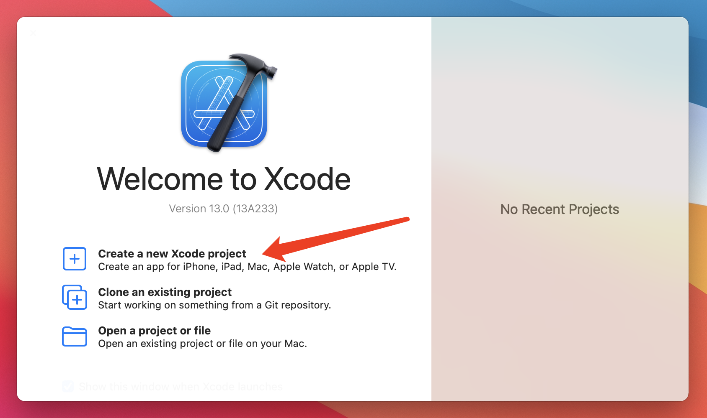
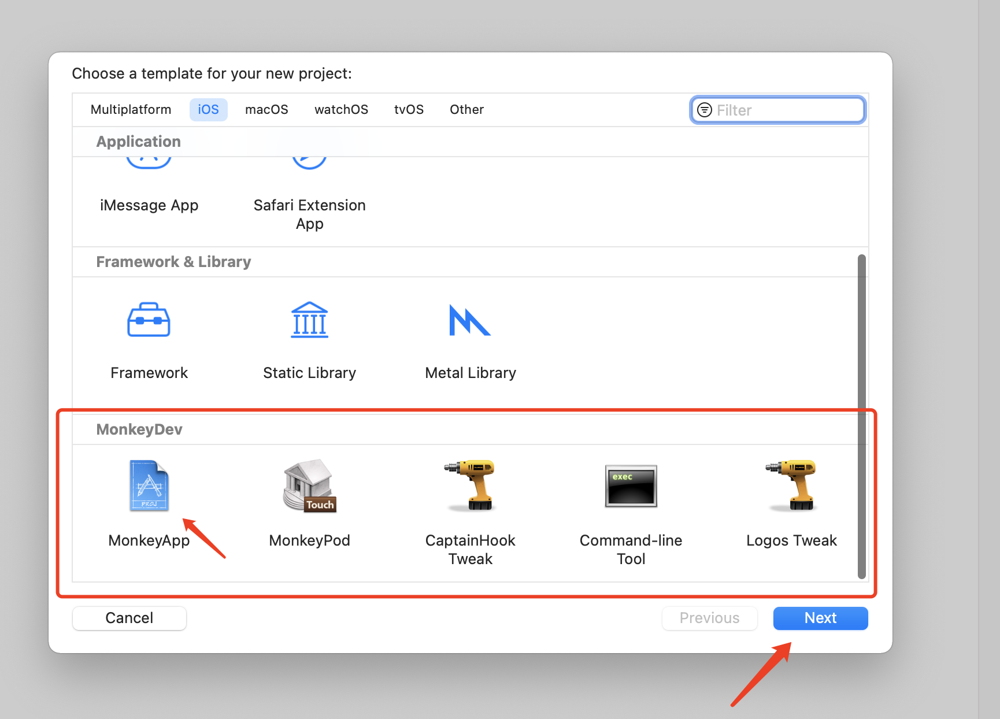
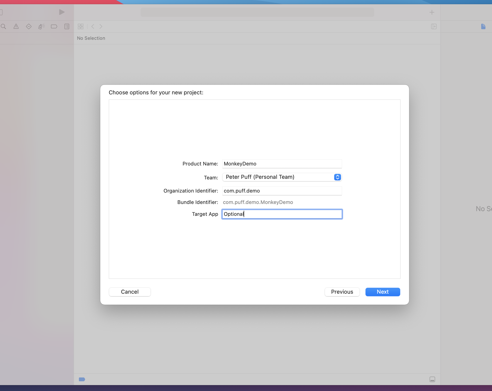
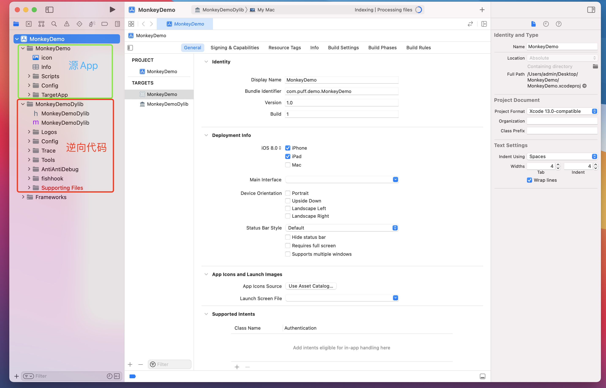
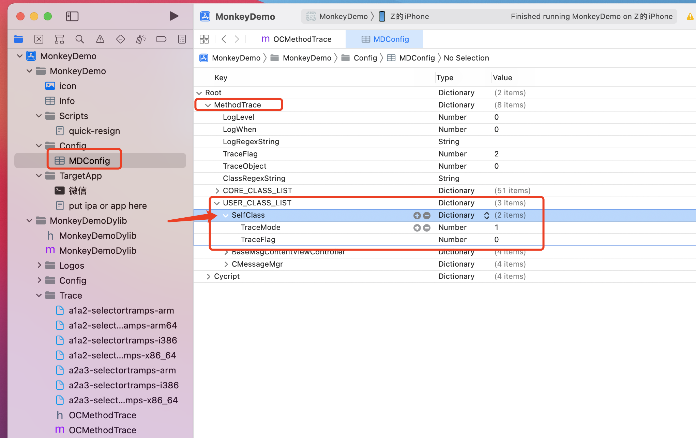
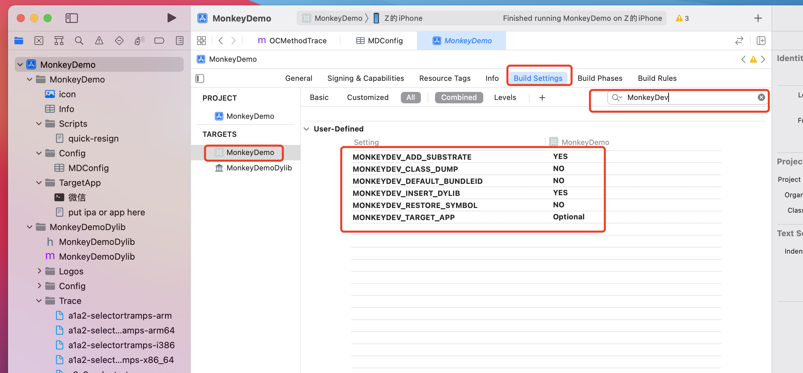
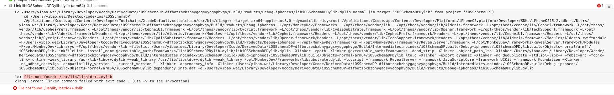

# [搭建MonkeyDev项目](https://puffhub.github.io/Crack/iOS-Crack/)


## 新建Xcode项目
如果按照上一章[逆向环境的搭建](./iOS逆向开发环境搭建.md)中的内容将依赖环境都装好了，那么就可以开始搭建Monkey项目了, 这个过程中有踩过的一些坑, 会在文中体现出来。



**点击新建项目**

如果你的环境正常的搭建完毕, 那么新建项目的时候可以再最下面看到多了一个MonkeyDev的类型. 这里面的5种分类其实就是之前介绍过的几个模块。




**新建完成后, 目录结构长这样**

整体分为2部分, MonkeyDemo是存放App相关的内容, MonkeyDemoDylib是主要写Hook代码的地方, 当项目运行起来后, **MonkeyDev会将这个Dylib和源App一起打包成一个App**. 我们都知道iOS的App在**加载的时候会自动扫描静态的Dylib文件, 扫描到之后会自动加载到内存中, 所以通过这种方式达到了Hook的目的**. (如果是安卓可能还需要修改Smali代码动态的Load一个so文件, iOS不需要~).



## MonkeyDev项目目录
### 源App目录 (MonkeyDemo)

- Script: 目前未知, 不过现在也用不到.
- Config: 这个是cycript的一些脚本下载以及methodtrace配置代码.
- TargetApp: 存放App的.ipa/.app文件.

**坑:**
第一次运行的时候放了ipa文件进去, 但是跑到手机上是个猴子图标, 这种情况需要看一下当前目录是不是生成了一个tmp目录, 在tmp目录中有.app文件, 我们将.app文件拷贝到TargetApp目录下再次运行就可以了

### 链接库目录 (MonkeyDemoDylib)

- MonkeyDemoDylib.h/MonkeyDemoDylib.m: 链接库的入口函数, 可以通过```CHDeclareClass```自定义一些hook的类.
- Logos: Logos Tweak文件的存放路径, 用来Hook App的方法. 存放的是.xm和.mm文件 (首次运行Xcode可能无法识别, 需要在右侧选择文件类型为 ```Objective-C Source```)
- Config: 是cycript的一些脚本下载以及methodtrace配置代码。
- Trace: 基本不需要修改, 这是MonkeyDev提供的可以对某个类进行全局方法Trace的文件
- LLDBTools: LLDB调试工具
- AntiAntiDebug: 这个里面是反反调试的代码。
- FishHook: 存放FishHook的代码, 用于Hook 系统函数.


### 拓展功能
#### MethodTrace
可以在Config中的MDConfig文件中配置需要Trace的类, 这样只要这个类被调用, 就会有日志输出. TraceMode控制开关.



#### MonkeyDev设置
在这里搜索MonkeyDev, 可以看到一共有5个配置项

比较重要的
- MONKEYDEV_CLASS_DUMP: 是否dump header文件.
- MONKEYDEV_DEFAULT_BUNDLEID: 是否打包后使用原app的bundleId.
- MONKEYDEV_RESTORE_SYMBOL: 是否恢复符号表. (有些App会抹掉符号表, 这样就根本看不到正常的函数名称, 打开这个可以看到真实的类名和函数名称).


### 最后的最后
选择真机运行项目就可以跑起来了, 需要注意运行/构建的项目是源App, 而不是链接库Dylib文件～


**遇到的问题**

---
提示 ````libstdc++.dylib```不存在


```git clone https://github.com/devdawei/libstdc-```
```sudo sh install-xcode_11+.sh```

---
