# 环境搭建


### 1、[微信开发者工具](https://developers.weixin.qq.com/miniprogram/dev/devtools/download.html) <br />


### 2、[VSCode](https://code.visualstudio.com/) <br />


### 3、[Nodejs环境](http://nodejs.cn/download/) <br />

### 4、[wxappUnpacker](https://github.com/puffhub/wxappUnpacker) <br />

<br />

# 项目文件构成
小程序本质上都是由类html的语法编写, 所以文件格式与html也很类似. [文件构成详细介绍](https://blog.csdn.net/web_only_/article/details/103048200)
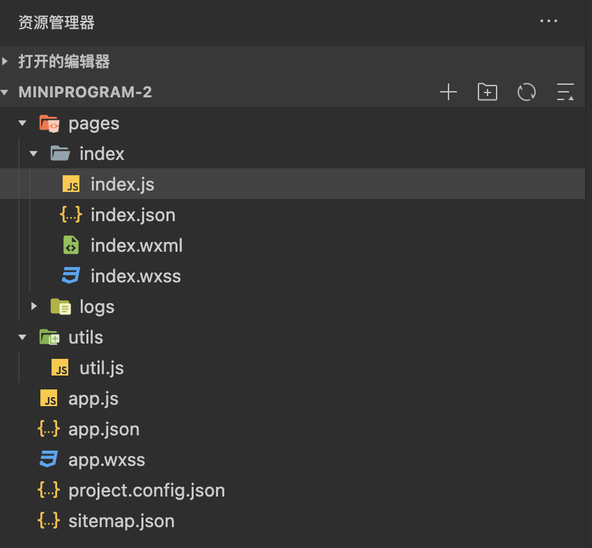

- Pages
	- index.wxml
		- 页面文件, 等同于html文件
	- index.wxss
		- 渲染文件, 写css语法
	- index.js
		- js文件
	- index.json
		- 页面配置文件, 
- app.js
	- 全局js文件
- app.json
	- 项目配置文件, 声明有哪些页面、使用组件等信息
- sitemap.json
	- 配置其小程序页面是否允许微信索引
- app.wxss
	- 全局渲染文件, 写css语法
- project.config.json
	- 对微信开发者工具的一些配置，可以根据需要的配置进行修改。编译器界面，代码提示等

<br />


# 基础语法
小程序使用的模版语法类似```Vue.js```的双向绑定, 数据都在JS中. 详细可以看[这里](https://blog.csdn.net/qq_42222342/article/details/106154624)
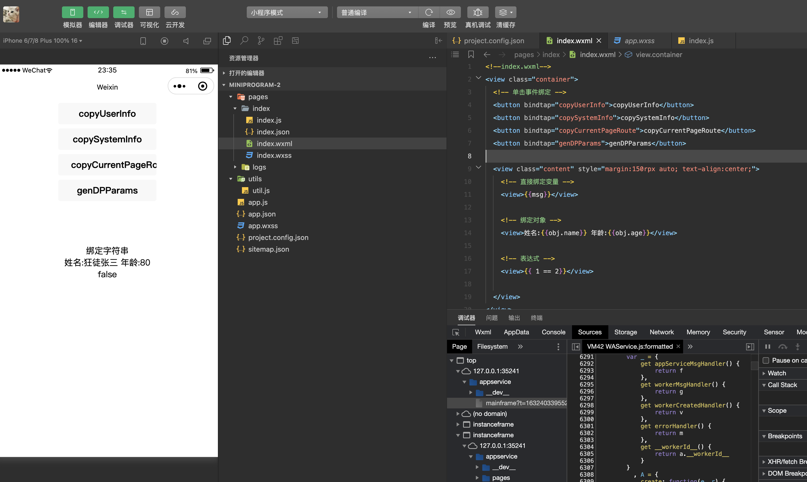

<br />
# 小程序逆向
## 获取小程序源文件
#### 1、使用root后的Android手机, 进入 ```/data/data/com.tencent.mm/MicroMsg/{user_id}/appbrand/pkg```目录下, 并将其中的内容全部删除
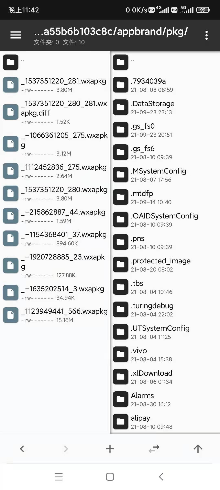

#### 2、删除文件后打开需要逆向的小程序, 这里以某评为例, 进入小程序后尽可能的多点击几个页面, 因为小程序的代码是动态加载的, 需要多触发一些渲染才能拿到比较全的代码. 点完之后回到刚才的路径, 此时在文件夹内的所有```*.wxapkg```后缀的文件就都是这个小程序的文件了.


## 反编译小程序文件
#### 1、进入```wxappUnpacker```的目录, 可以看到有一个bingo.sh文件, 只需要执行这个shell并加上需要反编译的小程序文件路径即可. 
反编译命令: ``` ./bingo xxxxxxx.wxapkg```


这里看到脚本提示检测到此包是分包后的子包, 说明这个小程序进行了分包操作, 我们需要先找到主包进行反编译, 使用的方式就是挨个进行尝试. (记得如果是子包需要先删除产生的文件夹).

尝试到第三个包的时候发现主包了


那就可以开始反编译子包了, 使用的命令相同, 只不过需要在后面带上 ```s={主包产出的文件夹路径}```. **这里有个小诀窍, 一般情况下小程序的包不会太大, 如果看到大小在15M以上的包一般情况下都是微信小程序的运行环境, 这个就不需要进行反编译了, 因为一定会失败.**

反编译子包命令: ``` ./bingo xxxxxxx.wxapkg -s={主包产出的文件夹路径}```

<br />
#### 2、使用微信开发者工具打开反编译后的主包目录, 选择使用测试号打开
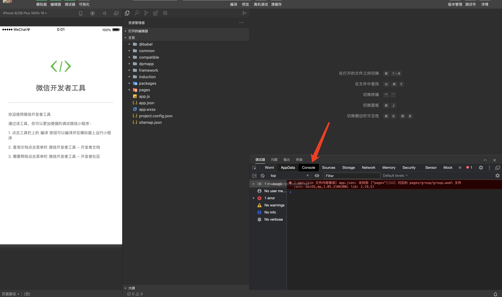

可以看到打开后有一个报错, 一般情况下打开小程序很少有能直接运行起来的, 所以需要先解决这些错误


## 小程序报错修复
#### 1、通过上面的报错可以看到, 项目中某一个wxml文件找不到了, 这是由于微信在更新8.0之后反编译的工具无法还原wxml文件导致的。我们只需要在app.json中删除这里即可.


#### 2、可以看到删除了之后出现了新的错误, 新的错误提示标签不正确, 我们点击报错中的白色链接, 跳转到对应的位置并删除报错的标签即可。

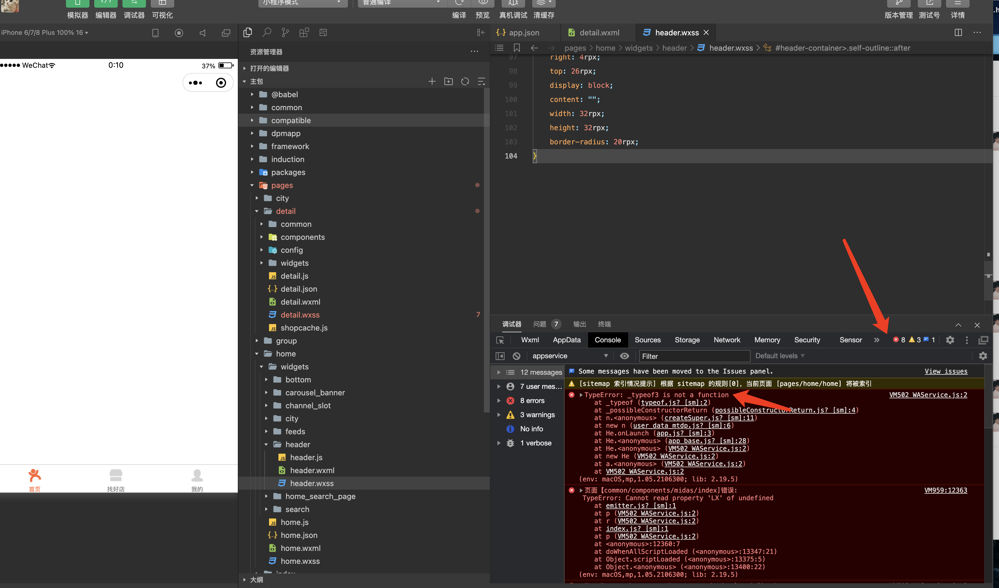

#### 3、刚修复好, 报错又变成了8个. 这种提示_typeof的错误一般可以通过**取消开发者工具的强制编译ES5来修复**, 同时勾选不校验合法域名
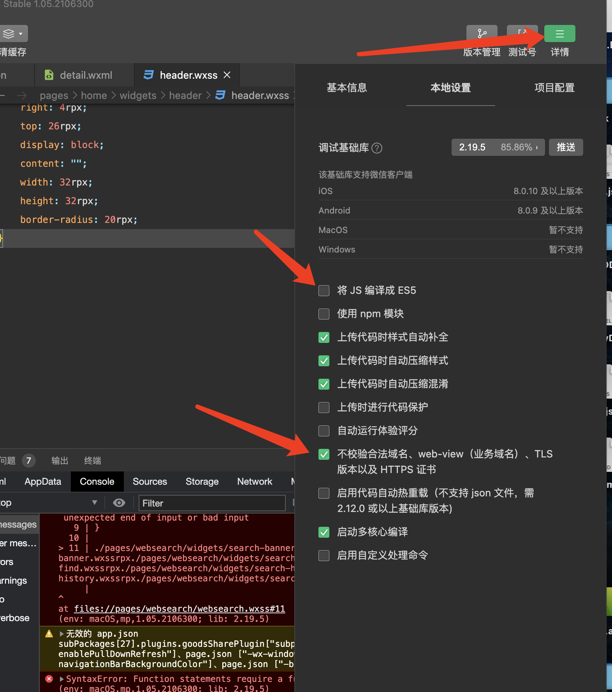

#### 4、之后出现的报错和之前类似, 解决后可以看到页面已经渲染出来了, 控制台的__plugin报错可以直接无视, 因为不影响正常逻辑
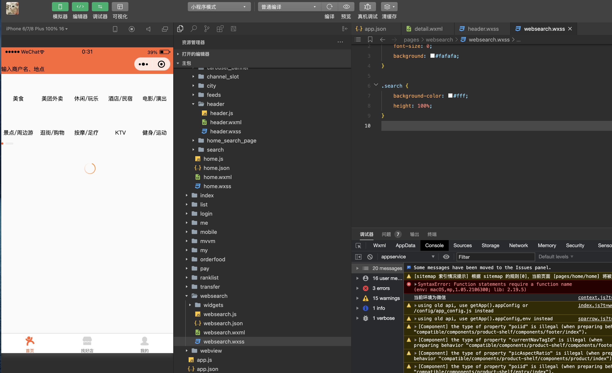

<br />
## 加密参数还原
经过之前的抓包, 本次需要还原的算法是请求头中的mp-mtgsig参数, 可以看到参数是一个json, 里面从a1到a7共7个参数, 可以先在小程序中搜索a1看看能不能搜到. (因为参数名很短, 搜索的时候最好打开精确匹配)
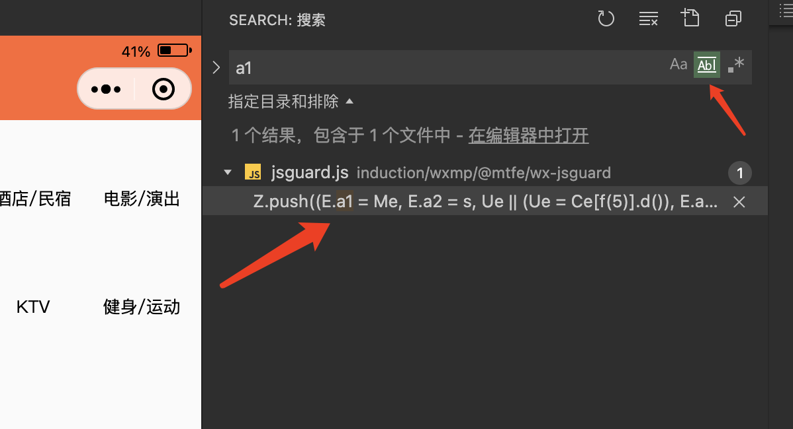
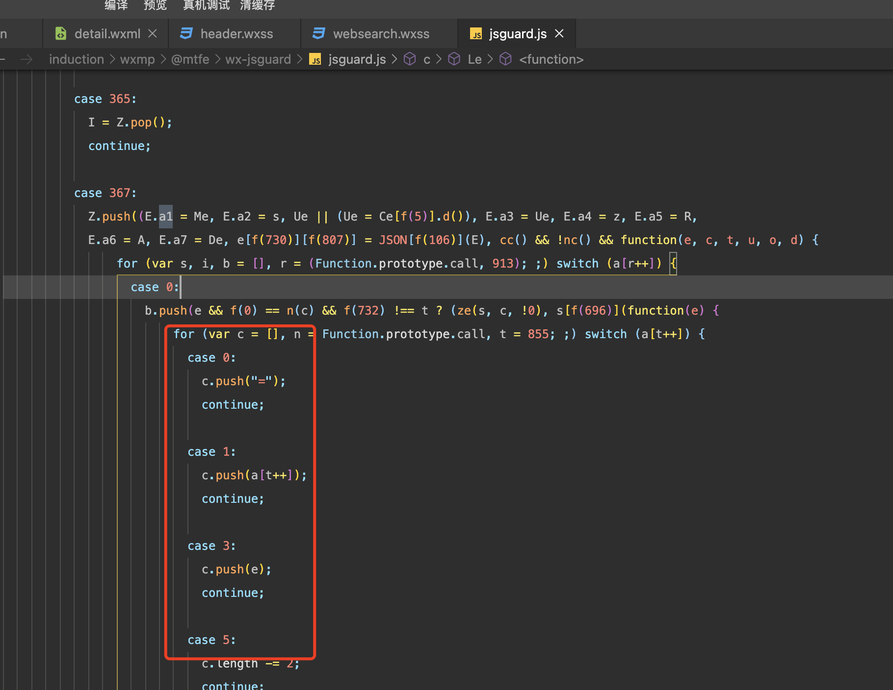

点开之后直接傻眼, 这种外层for套switch case的是很典型的控制流平台化混淆, 很难解. 只能一点一点扣.

简单分析了文件后发现, 所有的f(xxx)函数都会变成一个字符串, 而这些字符串恰好是JS中常用的方法名称, 所以可以先把文件内的所有f函数调用手动替换掉.
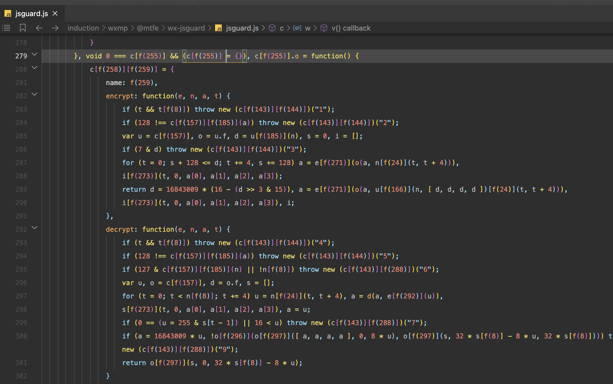

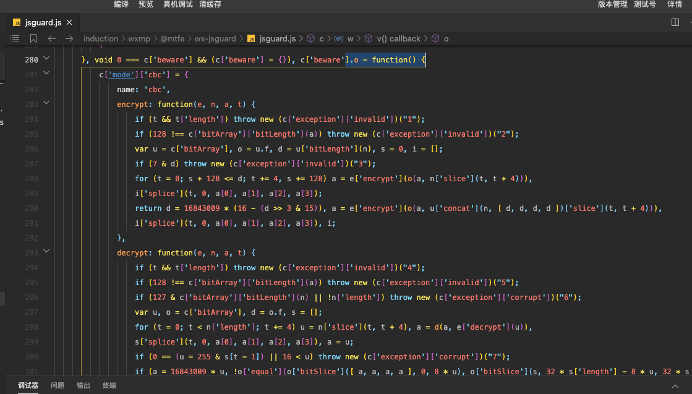

扣代码的逻辑大致如下:

- 1、找到加密参数赋值的位置
- 2、使用debugger断点, 并记录循环次数
- 3、通过记录的循环次数倒着往前推, 一步一步跟进加密参数的生成
- 4、获取到原始加密参数后, 进行运行环境补全并尝试在NodeJS中执行
- 5、对比小程序环境和NodeJS环境在参数相同的情况下是否生成的加密一致, 若一致则说明加密算法扣成功了！！！


# [小程序逆向教程](https://space.bilibili.com/36624848/video)


