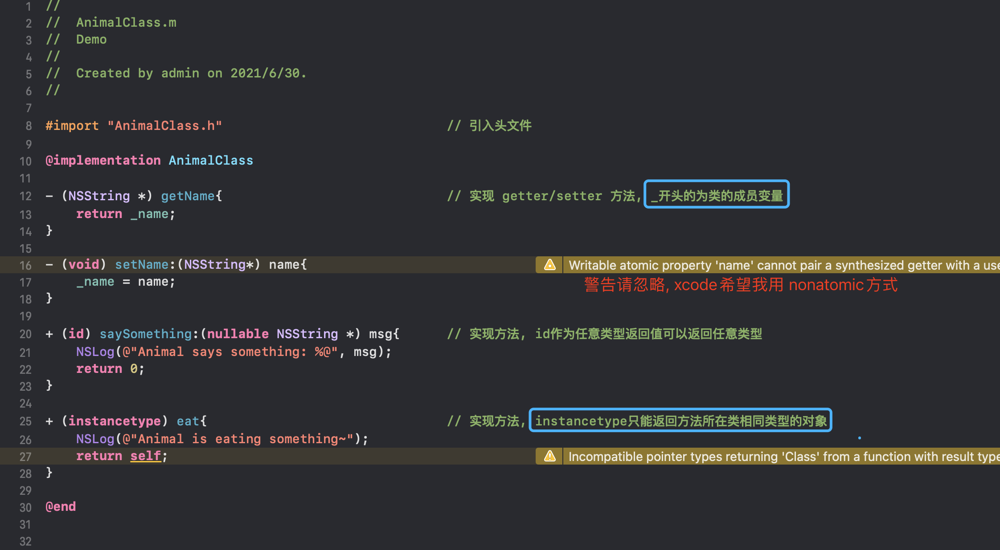

# [Objective-C 语法基础](https://puffhub.github.io/iOS-Crack/)


目录:<br />
&emsp;**[简介](#简介)**<br />
&emsp;**[文件名称规则](#文件名称规则)**<br />
&emsp;**[语法](#语法)**<br />
&emsp;**[指针](#指针)**<br />
&emsp;**[编译过程](#编译过程)**<br />
&emsp;**[常用库](#常用库)**<br />
&emsp;**[坑](#坑)**<br />


## 简介
```Objective-C```，通常写作```ObjC```或```OC```和较少用的```Objective C```或```Obj-C```，是扩充C的面向对象编程语言。它主要使用于Mac OS X和GNUstep这两个使用OpenStep标准的系统，而在NeXTSTEP和OpenStep中它更是基本语言。

Objective-C是编写以下应用的利器：

- iOS操作系统
- iOS应用程序
- iPad OS操作系统
- iPad OS应用程序
- Mac OS X操作系统
- Mac OS X应用程序

(以上来源: [百度百科](https://baike.baidu.com/item/Objective-C))

In people words: **Objective-C是C的超集, 可以在Objective-C中使用C语言做的任何事情, 仅仅是在C的基础上新增了很多方面的语法, 例如 ```#import```等。**

当年由于Jobs被自家的**Apple**赶出家门, 于是自立门户**NeXTSTEP**, 在系统和软件层面碾压了当时的**Apple**, 最终在1994年被**Apple**公司收购, 自此**Apple**公司开始使用**NeXTSTEP**的Objective-C语言, 并在后来的迭代中将**NeXTSTEP**保留下来的一些函数以```NS```开头命名。
<br /><br />


## 文件名称规则
和```C语言```一样, OC的文件也由两部分组成. (其实支持三种类型)

- ```.h``` ->  **头文件**, 包含 ```类名```、```类继承的父类```、```方法```、```变量声明```; 

- ```.m``` -> **实现文件**, 可以包含```Objective-C```的代码和```C```代码, 同时它是对.h文件中方法的实现, 外部不能访问;

- ```.mm``` -> **实现文件**,  和```.m```文件类似, 唯一不同的点在于除了可以包含```Objective-C```和```C```的代码之外, 还可以包含```C++```代码; 仅在你的```Objective-C```代码中确实需要使用```C++```类或者特性的时候才用这种扩展名。


## 语法
使用Xcode创建的app中, ```main.m```文件中的主函数

```objectivec
# import <UIKit/UIKit.h> 
# import "AppDelegate.h"
	
int main(int argc, char * argv[]) {
    NSString * appDelegateClassName;
    @autoreleasepool {
        // Setup code that might create autoreleased objects goes here.
        appDelegateClassName = NSStringFromClass([AppDelegate class]);
    }
    return UIApplicationMain(argc, argv, nil, appDelegateClassName);
}
```
<br />

### 类相关语法
这里直接列出类相关语法的使用方式, 感兴趣可以自己搜一下。或[菜鸟教程](https://www.runoob.com/w3cnote/objective-c-tutorial.html)

-  引入头文件: ```# import```、```# include```

-  调用方法: ``` [obj method:arg1 arg2:arg2] ```
<br />**(这里需要说明一下, 当一个方法存在多个参数时, 第一个参数可以不指定参数名, 后面的参数都需要指定参数名)**.

-  创建对象: ```[[obj alloc] init]``` 或 ```[ obj new ]``` 
<br /> **只有在OC2.0中, 创建的对象不需要参数时, 才可以用第二种直接new的写法**

-  类定义(.h): ```@interface MyClass : NSObject {} @end```
<br />**以关键字@interface作为开始, @end作为结束**

- 类实现定义(.m): ``` @implementation MyClass{} @end```
<br />**以关键字@ implementation作为开始, @end作为结束**

- 类定义:
	
- 类实现:
	
	
<br />
### 基本类型
OC的基本数据类型包括：**整型**、**字符型**、**浮点型**、**布尔型**、**枚举型**。

- **整型**
	<br />整型前加上unsigned关键字后，将它变成无符号整型，最高位不是符号位，而是数值位。
	- short: 短整型, 内存中占2子节, 即16位, 取值范围 [-32768 ~ 32767]
	- int: 整型, 占4子节, 取值范围 [-2147483648 ~ 2147483647]
	- long: 长整形, 通常占8字节
	- long long: 长整形, 通常占8字节.

- **字符型**
	<br />字符型在OC中只占用一个字节，OC字符变量不支持中文字符。可以使用转义字符表示特殊字符常量如```\n```。

- **浮点型**
	<br />浮点类型包括float、double和long double，float占用4字节，double占8字节，long double占16字节。

- **布尔型**
	<br />OC中BOOL类型有两个值: ```YES```和```NO```。

- **枚举型**
	<br />一个变量只有几种可能的值，这个变量就可以定义为枚举变量。 
	
	```enum season {spring,summer,fall,winter};```


### OC中常用数据类型

- NSString : OC中的字符串类型; 需要用@开头表示。 ```NSString * str = @"I'm a str";```
- NSInteger: OC中的int类型。
- NSArray : OC中的数组类型, **为不可变数组**。
- NSMutableArray: OC中的数组类型, **为可变数组**。
- NSMutableDictionary: OC中的字典类型(Map)。
- 待继续补充...


### 条件判断
if 条件判断

```objectivec
if (true){
	NSLog(@"abc");
} else {
	NSLog(@"cde");
}
```


### 循环
for 条件循环

```objectivec
	for (var int i=0; i<10; i++){
		NSLog(@"%d", i);
	}
```

while 条件循环

```objectivec
while(true){
	NSLog(@"123");
}
```

### 结构体
```objectivec
typedef struct {
	NSString name;
	int age;
} People;
```
**定义结构体** <br />
使用```typedef struct {}```定义一个结构体, 中间的```name```和```age```为这个结构体的属性. ```People```为这个结构体的名称.

**初始化结构体** <br />
使用```People p1 = {"puff", 24};``` 初始化该结构体

**结构体赋值** <br />

```objectivec
People p1 = {"puff", 24}; 		// 初始化
p1 = (People){"peter", 18}; 	// 赋值操作(如果不强转, Xcode会报错)
```

其他正向开发相关知识可参考[这里](https://www.jianshu.com/p/f1b2085c4179)


## 指针
指针是一个变量: ```int* p;``` -> 指针名字为```p```, 类型为```int *```, 在64位系统下所有的指针都是8个字节。

```objectivec
int a = 0;

// 初始化
int * p = &a; 	

// 赋值
p = &a;

// p记录的是a的地址，而且*p是4字节的，所以*p表示找到a的位置取4字节的长度来进行运算。所以*p=a。*p=8即a=8
*p = 8;		
```
地址是常量，指针是变量。<br />
指针是地址的变量。<br />
&6  这是不正确的。<br />
变量才有空间，所以变量有地址。<br />
常量没有空间，所以常量是没有地址的。<br />

内容摘自[这里](https://www.douban.com/note/335334437/), 感兴趣可以点开看下。


## 编译过程
[这里](https://www.jianshu.com/p/0e284c255667)已经讲的很详细了, 不多做概述。


## 常用库
**日志输出**:

```objectivec
NSLog(@"this is a log");
```

**文件操作**:

```NSFileManager``` (文件管理类，新建、删除、移动、遍历文件夹等)

```objectivec
// 创建文件管理类单例对象
NSFileManager *fileManger=[NSFileManager defaultManager];

// 创建目录; args: (文件夹目录, 是否附带中间路径, 目录属性, 如果目录创建失败返回的失败信息)
NSError *error=nil;
BOOL ret=[fileManager createDirectoryAtPath:@"/Users/puff/Test" withIntermediateDirectories:NO attributes:nil error:&error];
if(ret){
 NSLog(@"目录创建成功")；
}else{
   NSLog(@"目录创建失败，reason:%@",error)；
}
```

<br />
```NSFileHandle``` (操作文件, 读取、写入)

```objectivec
// 只读, 不可写
//从光标的位置读到文件末尾，如果不去操作光标位置，那么光标默认是在文件的最前面。读出的是二进制数据，要转换一下才能看到有意义的字符串
NSFileHandle *  = [NSFileHandle fileHandleForReadingAtPath:"/Users/puff/test/test.txt"]; NSLog(@"%@",[fileHandle  readDataToEndOffFile]);

// 只写, 不可读
NSFileHandle *  = [NSFileHandle fileHandleForWritingAtPath:"/Users/puff/test/test.txt"]; 

// 可读可写
NSFileHandle *  = [NSFileHandle fileHandleForUpdatingAtPath:"/Users/puff/test/test.txt"]; 

// 读取文件
NSLog(@"%@", [fileHandle  readDataToEndOffFile]);

// 写入数据
NSString *string=@"baidu.com";
[fileHandle  writeData:[string dataUsingEncoding:NSUTF8StringEncoding]];

// 在进行了文件数据的修改后，可以手动调用synchronizeFile方法，来完成数据的同步，这是很常用的。
[fileHandle  synchronizeFile];

// 每次打开文件，操作完成后，必须关闭文件。关闭之后就不能继续进行操作了。
[NSFileHandle  closeFile];
```

**数据库操作**:

[这里](https://www.jianshu.com/p/005dadd78ad6)很详细了.

**强转**:

[这里](https://blog.csdn.net/songweiwei27/article/details/65631384)

**Array操作**: 

不可变数组

```objectivec
// 创建一个不可变数组
NSArray *arr1 = nil;

// 为数组赋值, 赋值后不可变, nil -> 结束标识，相当于C语言的“\0”
arr1 = [NSArray arrayWithObjects:@"One", @"Two", @"Three", nil];
NSLog(@"arr1: %@", arr1);

// 访问数组成员
id tmpObj = [arr1 objectAtIndex:3];

// 推荐以下的新语法
NSString *str = @"Hello";

// 这样的方法自己主动在后面加入了nil
NSArray *arr2 = @[@"zhangsan", @"lisi", @"wangwu", @"zhaoliu" ,@"tianqi", str];
NSLog(@"arr2: %@", arr2);

// 访问数组成员
tmpObj = arr2[2];

```

可变数组

```objectivec
// 初始化可变数组
NSMutableArray *arr = [[NSMutableArray alloc] new];
// 创建一个大小为30的可变数组
NSMutableArray *firstArr = [NSMutableArray arrayWithCapacity:30];

// 添加元素
[firstArr addObject:@"One"];
[firstArr addObject:@"Two"];
[firstArr addObject:@"Three"];

// 删除元素
[firstArr removeObject:@"One"];
[firstArr removeObjectAtIndex:2];

// 插入元素
[firstArr insertObject:@"wangwu" atIndex:2];

// 遍历数组
NSUInteger number = [firstArr count];
for (int i = 0; i < number; i++) {
    id obj = firstArr[i];
    NSLog(@"%@", obj);
}

// 高速枚举
for (id obj in firstArr) {
    NSLog(@"Fast Enumeration: %@", obj);
}

```

**Map操作**

不可变字典

```objectivec
// 创建不可变字典, 其中1为key, one为value
NSDictionary * dict = [[NSDictionary alloc]initWithObjectsAndKeys:@"one",@"1",@"two",@"2",@"three",@"3",@"four",@"4", nil];

// 也可以这样创建
NSDictionary * dict2 = @{@"4" : @"Four", @"1" : @"One", @"2" : @"Two", @"3" : @"Three"};

// 获取key为3的值
NSString * value = [dict objectForKey:@"3"];

// 获取所有的key / value
NSArray * keys = [dict allKeys];
NSArray * values = [dict allValues];

// 遍历字典
for (NSString * key in dict) {
    // 每次循环key指向一个键, 通过遍历键，间接遍历了值
    NSLog(@"%@", dict[key]);
}
```

可变字典

```objectivec
// 初始化
NSMutableDictionary * mutableDict = [[NSMutableDictionary alloc] init];

// 赋值
[mutableDict setDictionary:@{@"1" : @"One", @"2" : @"Two", @"3" : @"Three"}];

// 增加
[mutableDict setObject:@"Four" forKey:@"4"];

// 通过key删除一个或多个值
[mutableDict removeObjectForKey:@"3"];
[mutableDict removeObjectsForKeys:@[@"1", @"2", @"3"]];

//删除所有键值对
[mutableDict removeAllObjects];

// 遍历字典
for (NSString * key in mutableDict) {
    NSLog(@"%@", mutableDict[key]);
}
```

## 坑
刚入坑iOS的时候看语法那叫一个费劲, 不过理解了基本的数据类型和如何调用一个对象的方法之后, 再看代码也就没那么费劲了。新手容易出现的问题还是在类型转换, 数组、字典的操作等这些方面出现问题，有个比较好的办法是可以点开代码的声明去看头文件里面的方法，大部分方法通过名字就知道是做什么的，还看不懂可以去网上查一下具体的用法。


